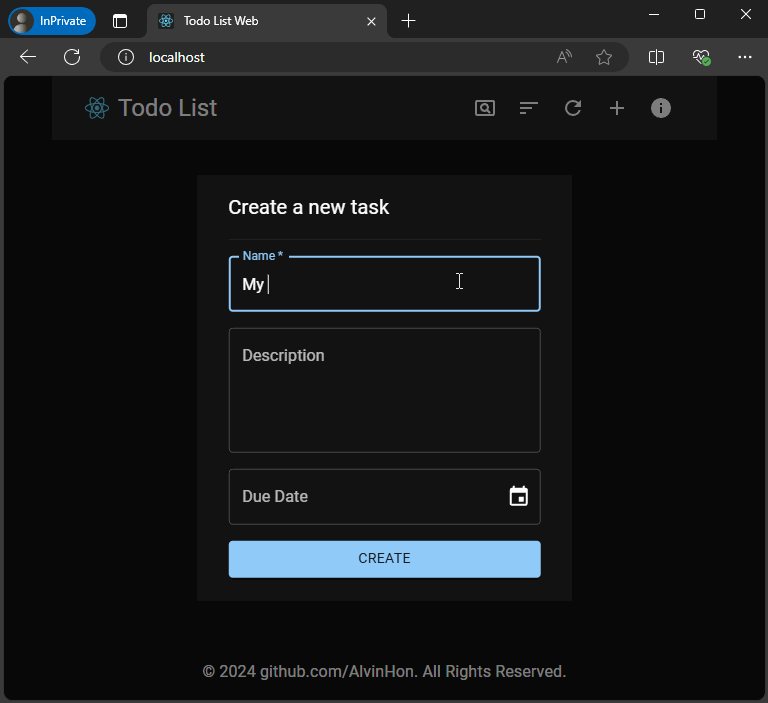

# Todo List Web

An example web application that allows users to manage TODOs.

## Features

- List Todo Items
    - support pagination
    - support filtering by Due Date, Status
    - support sorting by Due Data, Status, Name
- Create Todo Items
- Edit Todo Items
- Delete Todo Items
- Receive real-time notification triggered by activities:
    - someone creates a Todo item
    - someone updates a Todo item
    - someone deletes a Todo item




## Repository Organization

The repository contains folders:
- [server](./server/): the backend server implemented in `Spring Boot`, backed by `Jpa` with `mysql`.
- [web](./web): the frontend web application implemented in `React`.
- [proxy](./proxy/): contains a `docker` file for setting whole system.

## Architecture

The documents associated with the architecture:
- [Network Diagram](./proxy/README.md)
- [Backend API](./server/README.md#http-apis)
- [Call Flow](./web/README.md#call-flow)

## Build & Run in Docker

```sh
docker compose up -d
```


