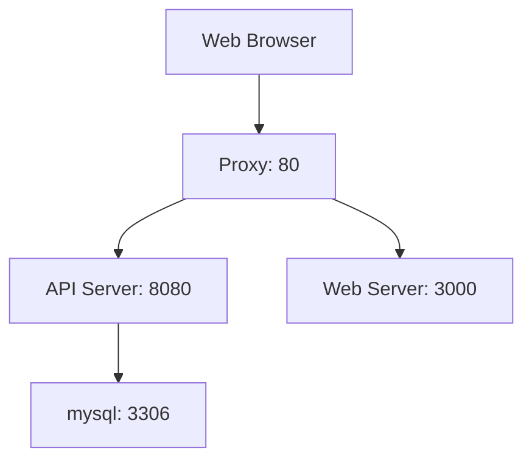

A reverse proxy for Todo List Web in which the applications can be run in docker environment.

The following network architecture showing the components with their accessible ports.

```mermaid
graph TD;
      WebBrowser[Web Browser]-->Proxy[Proxy: 80];
      Proxy-->ApiServer[API Server: 8080];
      Proxy-->WebServer[Web Server: 3000];
      ApiServer-->DB[mysql: 3306];
```