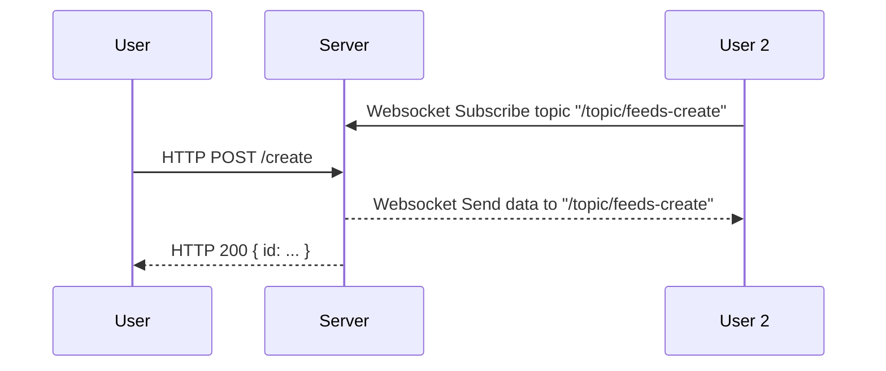

# Todo List Web (Frontend)

The `React` application serving the frontend of the Todo List Web. 

## Usage

Install the dependencies:
```sh
npm install
```

Run following commands for testing and starting a development server to serve the web.

```sh
# Run tests
npm test
# Start the development server
npm start
```

Then, you can access the web via `localhost:3000`.

### Run (for production)

Install `serve` for running the production build.
```sh
npm install -g serve
```

Create a production build
```sh
npm run build
```

The folder `/build` will be created. Then, run:
```sh
serve build
```

The web application runs at localhost with port `3000`.

## Configuration

The application uses environment variable `BACKEND_URL` to access to the backend server. By default, the value is `localhost:8080` if the environment variable is not set.

## Call Flow

This diagram describes the call flows for backend integration.



The web makes HTTP calls to backend server. The APIs reference can be found in [README.md](../server/README.md#http-apis).

The web also connects the the backend server via a websocket. This is for delivering real-time activity messages from other users.